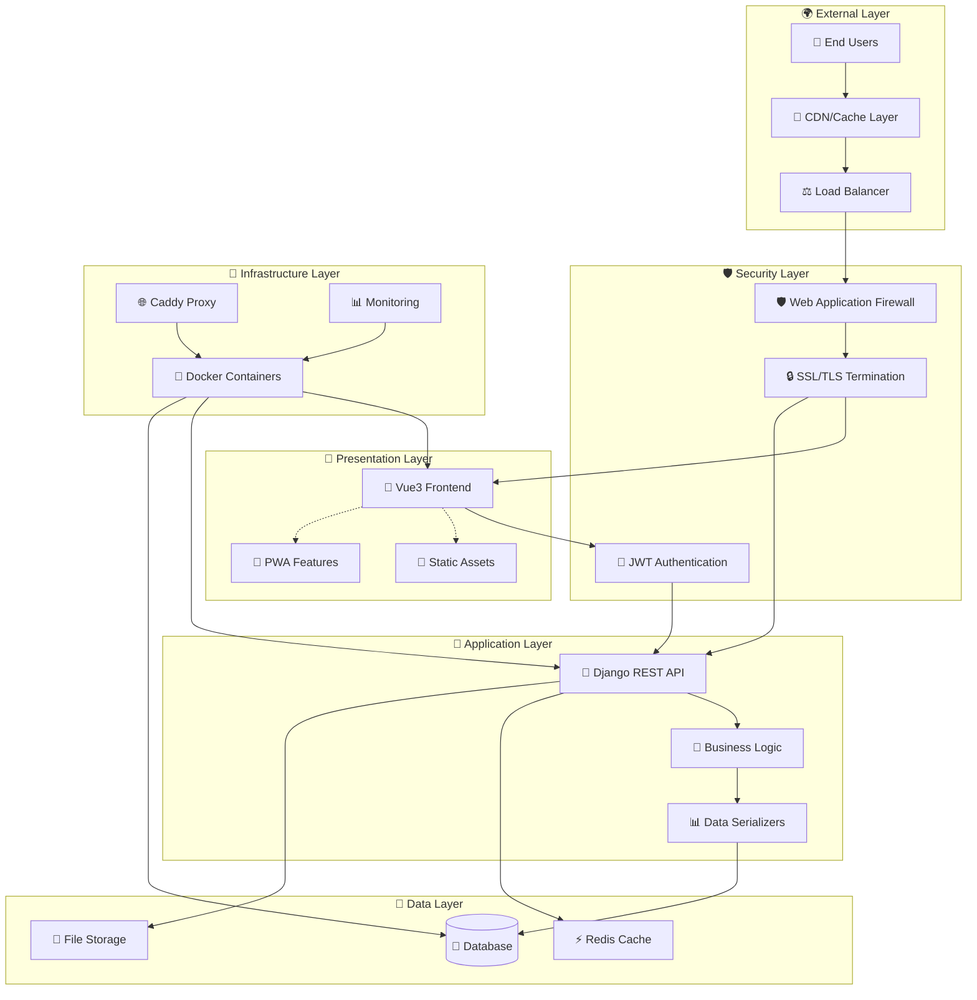

<div align="center">

# 📚 Foolstack Documentation Hub

### *Comprehensive Developer Resources & Technical Guides*

*Everything you need to master the Foolstack platform*

---

**🎯 [Quick Start](../README.md#-quick-start) • 🏗️ [Architecture](#-architecture-overview) • 🔐 [Security](./authentication.md) • 🛠️ [API Reference](./api-reference.md)**

</div>

---

## 🎯 Overview

Welcome to the **Foolstack Documentation Hub** – your comprehensive resource for building, deploying, and scaling enterprise-grade web applications. This documentation covers every aspect of the platform, from initial setup to advanced production deployment strategies.

<div align="center">

### 🚀 **Quick Navigation**

| 🎪 **For New Developers**                         | 🏗️ **For Architects**                             | 🔧 **For DevOps**                                |
|:-------------------------------------------------|:-------------------------------------------------|:------------------------------------------------|
| [🚀 Quick Start Guide](../README.md#-quick-start) | [🏗️ System Architecture](#-architecture-overview) | [🚢 Deployment Guide](./deployment.md)           |
| [🎓 Tutorial Series](./tutorials/)                | [📊 Performance Optimization](./performance.md)   | [📊 Monitoring & Observability](./monitoring.md) |
| [🐛 Troubleshooting](./troubleshooting.md)        | [🔌 API Design Patterns](./api-patterns.md)       | [🔒 Security Hardening](./security-hardening.md) |

</div>

## 📖 Documentation Sections

### 🚀 **Getting Started**

<table>
<tr>
<td width="50%">

#### 🎯 **Essential Guides**
- **[⚡ Installation & Setup](../README.md#-quick-start)**
  - One-command environment setup
  - Docker configuration and optimization
  - Development environment verification

- **[🎓 Your First Application](./tutorials/first-app.md)**
  - Build a complete feature from scratch
  - Best practices and conventions
  - Testing and deployment walkthrough

</td>
<td width="50%">

#### 🏗️ **Core Concepts**
- **[🎨 System Architecture](#-architecture-overview)**
  - Service interaction patterns
  - Data flow and state management
  - Scalability considerations

- **[🔧 Development Workflow](./development.md)**
  - Daily development practices
  - Debugging and troubleshooting
  - Performance optimization tips

</td>
</tr>
</table>

### 🏗️ **Backend Development**

<div align="center">

| 📚 **Resource**                                       | 🎯 **Focus Area**       | 🛠️ **Complexity Level** | 📋 **Status**  |
|:-----------------------------------------------------|:-----------------------|:-----------------------|:--------------|
| **[🔐 Authentication System](./authentication.md)**   | JWT, Custom User Model | 🟢 Beginner             | ✅ Complete    |
| **[🛠️ API Reference](./api-reference.md)**            | REST Endpoints         | 🟡 Intermediate         | ✅ Complete    |
| **[💾 Database Models](./models.md)**                 | Data Architecture      | 🟡 Intermediate         | 🚧 In Progress |
| **[🔌 Custom Endpoints](./custom-endpoints.md)**      | Advanced API Design    | 🔴 Advanced             | 📝 Planned     |
| **[⚡ Performance Tuning](./backend-performance.md)** | Optimization           | 🔴 Advanced             | 📝 Planned     |

</div>

### 🎨 **Frontend Development**

<div align="center">

| 📚 **Resource**                                              | 🎯 **Focus Area**       | 🛠️ **Complexity Level** | 📋 **Status** |
|:------------------------------------------------------------|:-----------------------|:-----------------------|:-------------|
| **[⚡ Vue3 Setup Guide](./frontend-setup.md)**               | Component Architecture | 🟢 Beginner             | 📝 Planned    |
| **[🔌 API Integration](./api-integration.md)**               | HTTP Client Setup      | 🟡 Intermediate         | 📝 Planned    |
| **[🎨 UI/UX Patterns](./ui-patterns.md)**                    | Design System          | 🟡 Intermediate         | 📝 Planned    |
| **[📱 PWA Configuration](./pwa-setup.md)**                   | Progressive Web App    | 🔴 Advanced             | 📝 Planned    |
| **[🚀 Performance Optimization](./frontend-performance.md)** | Bundle Optimization    | 🔴 Advanced             | 📝 Planned    |

</div>

### 🚀 **DevOps & Deployment**

<div align="center">

| 📚 **Resource**                                      | 🎯 **Focus Area**     | 🛠️ **Complexity Level** | 📋 **Status** |
|:----------------------------------------------------|:---------------------|:-----------------------|:-------------|
| **[🐳 Docker Configuration](./docker-guide.md)**     | Containerization     | 🟡 Intermediate         | 📝 Planned    |
| **[🚢 Production Deployment](./deployment.md)**      | Scaling & Deployment | 🔴 Advanced             | 📝 Planned    |
| **[📊 Monitoring & Logging](./monitoring.md)**       | Observability        | 🔴 Advanced             | 📝 Planned    |
| **[🔒 Security Hardening](./security-hardening.md)** | Production Security  | 🔴 Advanced             | 📝 Planned    |
| **[⚡ CI/CD Pipelines](./cicd.md)**                  | Automation           | 🔴 Advanced             | 📝 Planned    |

</div>

## 🏗️ Architecture Overview

### 🎨 **High-Level System Design**

<div align="center">



</div>

### ⚙️ **Technology Stack Matrix**

<table>
<tr>
<td width="25%">

#### 🏗️ **Backend Core**
- **Framework**: Django 5.2.4
- **API Layer**: DRF 3.14.0
- **Authentication**: Simple JWT
- **ORM**: Django ORM
- **Validation**: DRF Serializers
- **Admin**: Django Admin

</td>
<td width="25%">

#### 🎨 **Frontend Core**
- **Framework**: Vue.js 3.x
- **Build System**: Vite 4.x
- **Language**: JavaScript/TS
- **State**: Composition API
- **Routing**: Vue Router
- **HTTP**: Fetch API

</td>
<td width="25%">

#### 🗄️ **Data & Storage**
- **Database**: SQLite/PostgreSQL
- **Cache**: Redis (optional)
- **Files**: Local/S3 compatible
- **Search**: Full-text search
- **Backup**: Automated scripts
- **Migration**: Django migrations

</td>
<td width="25%">

#### 🚀 **Infrastructure**
- **Containers**: Docker/Compose
- **Proxy**: Caddy 2.8
- **SSL**: Auto Let's Encrypt
- **Monitoring**: Health checks
- **Logging**: Structured logs
- **Deployment**: Zero-downtime

</td>
</tr>
</table>

### 🔄 **Request Flow Architecture**

<details>
<summary><strong>📊 Detailed Request Processing Flow</strong></summary>

1. **🌍 User Request** → Caddy Proxy (SSL termination, routing)
2. **🔒 Security Layer** → CORS validation, rate limiting
3. **🎨 Frontend Route** → Vue Router, component loading
4. **🔌 API Request** → Authentication header injection
5. **🔐 JWT Validation** → Token verification, user context
6. **🛠️ Business Logic** → Django view processing
7. **📊 Data Serialization** → DRF serializer validation
8. **💾 Database Query** → ORM query execution
9. **📤 Response Formation** → JSON response structure
10. **🎨 UI Update** → Vue reactive state updates

</details>

## 🛠️ **Developer Tools & Resources**

### 🎯 **Essential Development Tools**

<div align="center">

| 🛠️ **Tool Category**          | 📋 **Recommended Tools**                 | 🎯 **Purpose**                        |
|:-----------------------------|:----------------------------------------|:-------------------------------------|
| **🏗️ Backend Development**    | Django Debug Toolbar, Django Extensions | API debugging & optimization         |
| **🎨 Frontend Development**   | Vue DevTools, Vite HMR                  | Component debugging & hot reload     |
| **🐳 Container Management**   | Docker Desktop, Portainer               | Container orchestration & monitoring |
| **📊 Database Management**    | DB Browser for SQLite, pgAdmin          | Database administration              |
| **🔍 Testing & QA**           | Pytest, Jest, Cypress                   | Automated testing frameworks         |
| **📈 Performance Monitoring** | Django Silk, Lighthouse                 | Performance profiling & analysis     |

</div>

### 🎓 **Learning Resources**

<details>
<summary><strong>📚 Recommended Learning Path</strong></summary>

#### 🥇 **Beginner Path** (0-3 months)
1. **Complete the [Quick Start Guide](../README.md#-quick-start)**
2. **Follow [First Application Tutorial](./tutorials/first-app.md)**
3. **Study [Authentication Implementation](./authentication.md)**
4. **Practice with [API Reference](./api-reference.md)**

#### 🥈 **Intermediate Path** (3-6 months)
1. **Master [Custom Endpoints](./custom-endpoints.md)**
2. **Implement [Advanced UI Patterns](./ui-patterns.md)**
3. **Configure [Performance Optimization](./performance.md)**
4. **Setup [Testing Strategies](./testing.md)**

#### 🥉 **Advanced Path** (6+ months)
1. **Architect [Microservices Migration](./microservices.md)**
2. **Implement [Advanced Security](./security-hardening.md)**
3. **Master [Production Deployment](./deployment.md)**
4. **Contribute to [Open Source](./contributing.md)**

</details>

## 🤝 Contributing to Documentation

### 📝 **Documentation Standards**

We maintain high-quality documentation through:

- **📊 Clear Structure** → Consistent formatting and organization
- **🎯 Practical Examples** → Real-world code samples and use cases
- **🔍 Comprehensive Coverage** → Every feature thoroughly documented
- **🚀 Regular Updates** → Documentation stays current with codebase
- **👥 Community Input** → Feedback-driven improvements

### 🛠️ **How to Contribute**

<details>
<summary><strong>📋 Documentation Contribution Workflow</strong></summary>

```bash
# 1️⃣ Fork and clone documentation
git clone https://github.com/yourusername/foolstack.git
cd foolstack/docs

# 2️⃣ Create documentation branch
git checkout -b docs/improve-auth-guide

# 3️⃣ Make improvements
# Edit existing files or create new ones
# Follow the documentation style guide

# 4️⃣ Test documentation locally
# Ensure all links work and formatting is correct

# 5️⃣ Submit pull request
git add .
git commit -m "docs: improve authentication guide with examples"
git push origin docs/improve-auth-guide
# Open PR on GitHub
```

</details>

## 🆘 Support & Community

### 💬 **Getting Help**

<div align="center">

| 🎯 **Issue Type**               | 📍 **Best Resource**                                                         | ⏱️ **Response Time** |
|:-------------------------------|:----------------------------------------------------------------------------|:--------------------|
| **🐛 Bug Reports**              | [GitHub Issues](https://github.com/yourusername/foolstack/issues)           | 1-2 business days   |
| **❓ General Questions**        | [GitHub Discussions](https://github.com/yourusername/foolstack/discussions) | Community-driven    |
| **💡 Feature Requests**         | [GitHub Issues](https://github.com/yourusername/foolstack/issues)           | Weekly review       |
| **🚀 Urgent Production Issues** | [Priority Support](mailto:support@foolstack.dev)                            | 4-6 hours           |

</div>

### 🎯 **Documentation Feedback**

Found an issue with the documentation? Help us improve:

- **📝 [Suggest Improvements](https://github.com/yourusername/foolstack/issues/new?template=documentation.md)**
- **🔍 [Report Missing Information](https://github.com/yourusername/foolstack/discussions)**
- **⭐ [Contribute Examples](./contributing.md)**

---

<div align="center">

**📚 Happy Learning & Building! 🚀**

*This documentation is continuously updated. Last updated: $(date)*

[⬆️ Back to Top](#-foolstack-documentation-hub) • [🏠 Main README](../README.md) • [🤝 Contributing](./contributing.md)

</div>