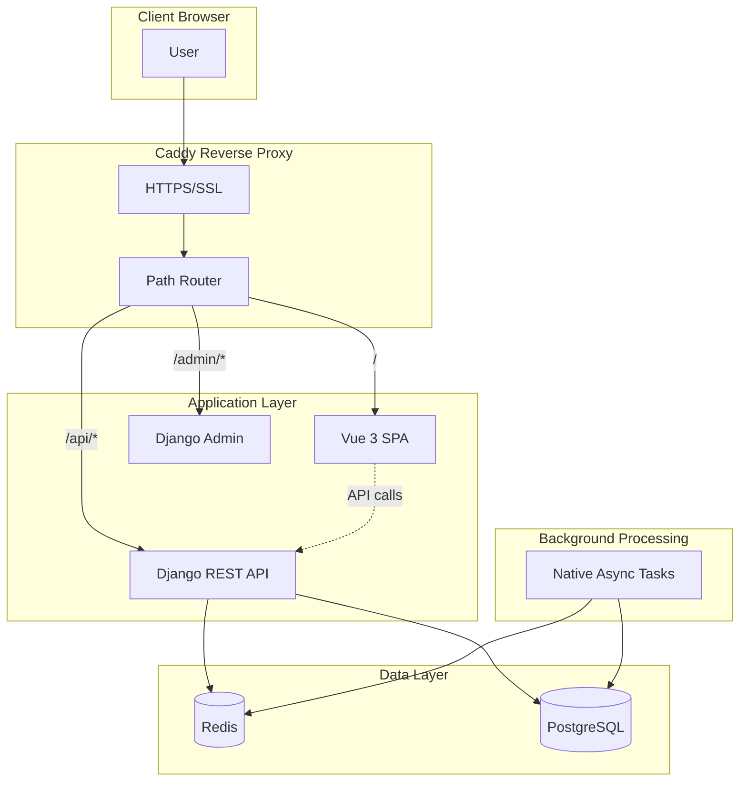

<div align="center">

# Foolstack Documentation

### Developer Resources & Technical Guides

---

**[Quick Start](../README.md#quick-start) | [Architecture](#architecture) | [API Reference](./api-reference.md) | [Authentication](./authentication.md)**

</div>

---

## Overview

Foolstack is a production-ready full-stack template featuring Django 6.0 REST API, Vue 3 SPA, Redis, PostgreSQL 16, and automatic HTTPS via Caddy.

<div align="center">

### Quick Navigation

| For Developers                                | For DevOps                                                  |
|-----------------------------------------------|-------------------------------------------------------------|
| [Quick Start](../README.md#quick-start)       | [Production Deployment](../README.md#production-deployment) |
| [API Reference](./api-reference.md)           | [Configuration](../README.md#configuration)                 |
| [Authentication](./authentication.md)         | [Docker Setup](#docker-architecture)                        |
| [Template Customization](./TEMPLATE_USAGE.md) | [Health Monitoring](#health-endpoints)                      |

</div>

## Documentation

<div align="center">

| Document                              | Description                                       | Status   |
|---------------------------------------|---------------------------------------------------|----------|
| [API Reference](./api-reference.md)   | REST endpoints, request/response formats          | Complete |
| [Authentication](./authentication.md) | JWT auth, custom user model, frontend integration | Complete |
| [Template Usage](./TEMPLATE_USAGE.md) | How to customize this template for your project   | Complete |
| [AI Instructions](../AGENTS.md)       | Instructions for AI pair programming              | Complete |

</div>

## Architecture

### System Overview

<div align="center">


```mermaid
graph TB
    subgraph "Client Browser"
        User[User]
    end

    subgraph "Caddy Reverse Proxy"
        SSL[HTTPS/SSL]
        Router[Path Router]
    end

    subgraph "Application Layer"
        Vue[Vue 3 SPA]
        Django[Django REST API]
        Admin[Django Admin]
    end

    subgraph "Background Processing"
        Tasks[Native Async Tasks]
    end

    subgraph "Data Layer"
        Redis[(Redis)]
        Postgres[(PostgreSQL)]
    end

    User --> SSL
    SSL --> Router

    Router -->|"/"| Vue
    Router -->|"/api/*"| Django
    Router -->|"/admin/*"| Admin

    Django --> Postgres
    Django --> Redis
    Tasks --> Postgres
    Tasks --> Redis

    Vue -.->|"API calls"| Django
```

</div>

### Request Flow

1. **User Request** → Caddy (SSL termination)
2. **Path Routing**:
   - `/` → Vue SPA
   - `/api/*` → Django REST API
   - `/admin/*` → Django Admin
3. **Authentication** → JWT token validation
4. **Business Logic** → Django views/serializers
5. **Data Access** → PostgreSQL + Redis cache
6. **Response** → JSON back through Caddy

### Technology Stack

<table>
<tr>
<td width="25%">

#### Backend
- **Framework**: Django 6.0
- **API**: Django REST Framework
- **Auth**: SimpleJWT
- **Tasks**: Native Threaded Tasks
- **Logging**: Loguru

</td>
<td width="25%">

#### Frontend
- **Framework**: Vue 3
- **Build**: Vite 8
- **Styling**: Tailwind CSS 4
- **HTTP**: Axios (Interceptors)
- **Routing**: Vue Router

</td>
<td width="25%">

#### Data
- **Database**: PostgreSQL 16
- **Cache**: Redis 7
- **Session**: Redis 7
- **Files**: Local storage

</td>
<td width="25%">

#### Infrastructure
- **Containers**: Docker
- **Proxy**: Caddy 2
- **SSL**: Auto (Let's Encrypt)
- **Compose**: Overlay pattern

</td>
</tr>
</table>

## Docker Architecture

### Services

| Service  | Container         | Purpose             | Port            |
|----------|-------------------|---------------------|-----------------|
| `server` | Django + Gunicorn | REST API            | 8000 (internal) |
| `client` | Vue + Vite        | Frontend SPA        | 5173 (internal) |
| `db`     | PostgreSQL 16     | Primary database    | 5432            |
| `redis`  | Redis 7           | Cache + session     | 6379            |
| `caddy`  | Caddy 2           | Reverse proxy + SSL | 80, 443         |

### Compose Overlay Pattern

```
docker-compose.yml          # Base production config
docker-compose.dev.yml      # Development overrides (hot reload, port exposure)
```

Development mode (`ENVIRONMENT=development`) automatically uses both files.

## Health Endpoints

| Endpoint       | Purpose          | Checks                      |
|----------------|------------------|-----------------------------|
| `/api/ping/`   | Fast healthcheck | Database connectivity       |
| `/api/health/` | Comprehensive    | Database, Redis, disk space |

Used by Docker healthchecks and monitoring systems.

## Environment Configuration

All configuration via `.env` file. See [.env.example](../.env.example) for full documentation.

### Required Variables

```env
PROJECT_NAME=foolstack      # Container/volume naming
DOMAIN=localhost            # Your domain
ENVIRONMENT=development     # development or production
SECRET_KEY=<generated>      # Django secret key
POSTGRES_PASSWORD=...       # Database password
```

### Optional Variables

```env
LOG_LEVEL=INFO              # DEBUG, INFO, WARNING, ERROR
CADDY_EMAIL=admin@...       # Let's Encrypt notifications
```

### Port Configuration

All ports have sensible defaults but can be customized:

```env
CADDY_HTTP_PORT=80
CADDY_HTTPS_PORT=443
SERVER_PORT=8000
CLIENT_PORT=5173
REDIS_PORT=6379
POSTGRES_PORT=5432
```

## Development Workflow

### Daily Commands

```bash
make up          # Start services
make logs s      # Watch server logs
make shell       # Django shell for debugging
make down        # Stop services
```

### Adding Features

1. Create Django app: `make manage startapp myapp`
2. Add to `INSTALLED_APPS` in `server/core/settings.py`
3. Create models (inheriting from `core.models.BaseModel`), serializers, views
4. Add URL route in `server/core/urls.py`
5. Run `make migrations && make migrate`

### Testing

```bash
make test              # Run all tests
make test-coverage     # With coverage report
```

## Security Features

- **HTTPS Everywhere**: Self-signed (dev), Let's Encrypt (prod)
- **Non-root Containers**: Server runs as `appuser` (UID 1000)
- **JWT Authentication**: Short-lived access tokens + refresh rotation
- **CSRF Protection**: Handled via secure cookies for session-based admin
- **Security Headers**: Via Caddy (X-Frame-Options, etc.)

---

<div align="center">

**[Back to README](../README.md) | [API Reference](./api-reference.md) | [Authentication](./authentication.md)**

</div>
